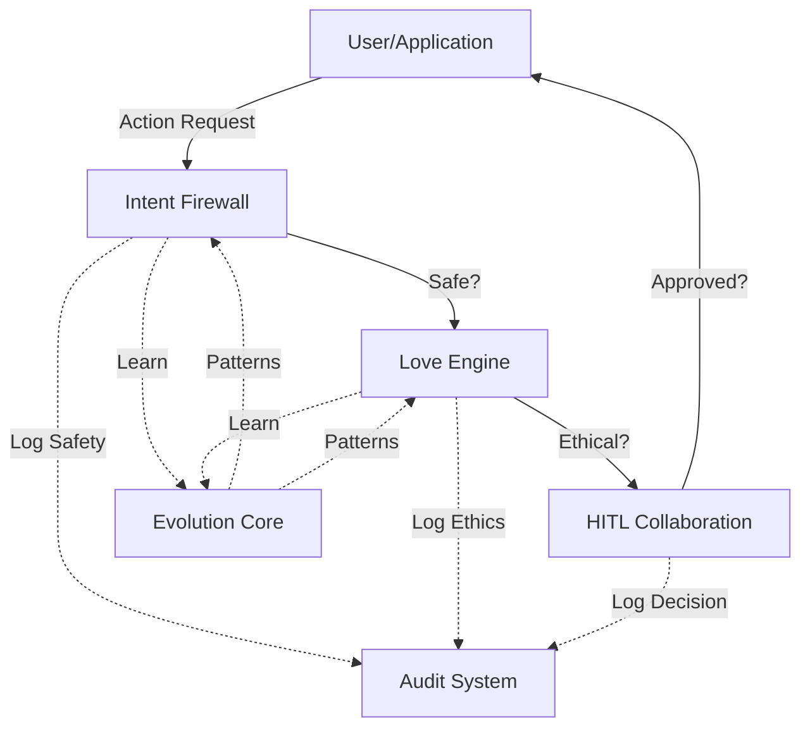
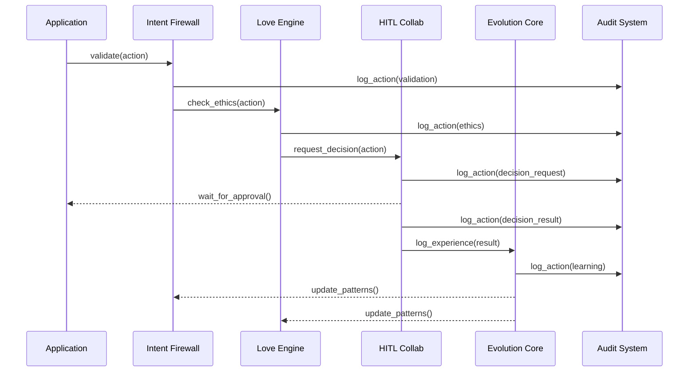
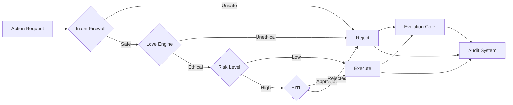
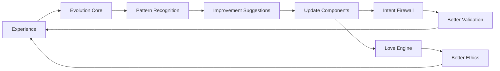

# Documentation Templates for Day 10
**Created**: 2025-12-17 08:51 PST
**Purpose**: Templates and outlines for Sprint 2 Day 10 documentation
**Target**: Sprint 2 Day 10 implementation
**Focus**: System-level documentation and Sprint 2 completion

---

## Template 1: System-Level README

```markdown
# Aegis-Rust: Self-Evolving Agent System

## Overview

Aegis-Rust is a production-ready self-evolving agent system built in Rust, featuring comprehensive safety mechanisms, ethical evaluation, human-in-the-loop collaboration, continuous learning, and cryptographic audit trails.

## Architecture

### Core Components

1. **Intent Firewall** (`intent-firewall`)
   - Purpose: [FILL: Safety validation for all actions]
   - Key Features: [FILL: Pattern matching, safety scoring, configurable thresholds]
   - Performance: [FILL: From benchmark results]

2. **Love Engine** (`love-engine`)
   - Purpose: [FILL: Multi-dimensional ethical evaluation]
   - Key Features: [FILL: 5 ethical dimensions, hallucination detection, thermodynamic love metric]
   - Performance: [FILL: From benchmark results]

3. **Evolution Core** (`evolution-core`)
   - Purpose: [FILL: Continuous learning and self-improvement]
   - Key Features: [FILL: Experience logging, pattern recognition, improvement suggestions]
   - Performance: [FILL: From benchmark results]

4. **Audit System** (`audit-system`)
   - Purpose: [FILL: Cryptographic audit trail]
   - Key Features: [FILL: Ed25519 signatures, blockchain-like chaining, SQLite backend]
   - Performance: [FILL: From benchmark results]

5. **HITL Collaboration** (`hitl-collab`)
   - Purpose: [FILL: Human-in-the-loop decision making]
   - Key Features: [FILL: Priority-based escalation, timeout handling, decision queue]
   - Performance: [FILL: From benchmark results]

## Quick Start

### Prerequisites

- Rust 1.70 or later
- Cargo
- SQLite 3.x (for audit system)

### Installation

```bash
git clone [REPOSITORY_URL]
cd aegis-rust
cargo build --release
```

### Running Tests

```bash
# Run all tests
cargo test --workspace

# Run specific component tests
cargo test -p intent-firewall
cargo test -p love-engine
cargo test -p evolution-core
cargo test -p audit-system
cargo test -p hitl-collab

# Run integration tests
cargo test --test integration_tests
```

### Running Benchmarks

```bash
# Run all benchmarks
cargo bench --workspace

# Run specific component benchmarks
cargo bench -p intent-firewall
cargo bench -p love-engine
```

## Usage Examples

### Example 1: Basic Action Validation

```rust
use intent_firewall::{BasicIntentFirewall, ActionRequest};
use serde_json::json;

let firewall = BasicIntentFirewall::new(0.7);
let request = ActionRequest {
    action: "read_file".to_string(),
    parameters: json!({"path": "/tmp/test.txt"}),
    context: "User requested file read".to_string(),
};

match firewall.validate(&request) {
    Ok(result) => {
        if result.is_safe {
            println!("Action approved: {}", result.reasoning);
        } else {
            println!("Action blocked: {}", result.reasoning);
        }
    }
    Err(e) => eprintln!("Validation error: {}", e),
}
```

### Example 2: Ethical Evaluation

```rust
use love_engine::BasicLoveEngine;

let engine = BasicLoveEngine::new(0.6);
let result = engine.check_ethics(
    "delete_file",
    &json!({"path": "/important/data.txt"}),
    "User wants to delete an important file"
);

match result {
    Ok(eval) => {
        println!("Ethical score: {:.2}", eval.score);
        if !eval.concerns.is_empty() {
            println!("Concerns: {:?}", eval.concerns);
        }
    }
    Err(e) => eprintln!("Evaluation error: {}", e),
}
```

### Example 3: Complete Workflow

```rust
[FILL: End-to-end workflow example from END_TO_END_WORKFLOWS.md]
```

## Performance Characteristics

### Throughput

| Component | Operations/sec | Notes |
|-----------|----------------|-------|
| Intent Firewall | [FILL] | [FILL: From benchmarks] |
| Love Engine | [FILL] | [FILL: From benchmarks] |
| Evolution Core | [FILL] | [FILL: From benchmarks] |
| Audit System | [FILL] | [FILL: From benchmarks] |
| HITL Collaboration | [FILL] | [FILL: From benchmarks] |

### Latency (P95)

| Component | Latency | Notes |
|-----------|---------|-------|
| Intent Firewall | [FILL] | [FILL: From benchmarks] |
| Love Engine | [FILL] | [FILL: From benchmarks] |
| Evolution Core | [FILL] | [FILL: From benchmarks] |
| Audit System | [FILL] | [FILL: From benchmarks] |
| HITL Collaboration | [FILL] | [FILL: From benchmarks] |

### Scalability

| Component | Tested Scale | Performance |
|-----------|--------------|-------------|
| Evolution Core | [FILL: e.g., 1M experiences] | [FILL: From scalability tests] |
| Audit System | [FILL: e.g., 1M entries] | [FILL: From scalability tests] |
| Intent Firewall | [FILL: e.g., 10K patterns] | [FILL: From scalability tests] |

## Deployment

### Production Deployment

[FILL: Deployment instructions]

### Configuration

[FILL: Configuration options]

### Monitoring

[FILL: Monitoring and alerting setup]

## Contributing

[FILL: Contribution guidelines]

## License

[FILL: License information]

## Documentation

- [Architecture Documentation](ARCHITECTURE.md)
- [Integration Guide](INTEGRATION_GUIDE.md)
- [Performance Report](PERFORMANCE_REPORT.md)
- [API Documentation](https://docs.rs/aegis-rust)

## Support

[FILL: Support information]
```

---

## Template 2: Integration Guide

```markdown
# Aegis-Rust Integration Guide

## Overview

This guide explains how to integrate the Aegis-Rust components into your application.

## Integration Patterns

### Pattern 1: Safety-First Validation

**Use Case**: Validate all actions before execution

**Components**: Intent Firewall → Your Application

**Implementation**:

```rust
[FILL: Code example from INTEGRATION_TEST_SPECS.md]
```

**When to Use**: [FILL]

**Performance**: [FILL]

---

### Pattern 2: Ethical Evaluation Pipeline

**Use Case**: Ensure all actions meet ethical standards

**Components**: Intent Firewall → Love Engine → Your Application

**Implementation**:

```rust
[FILL: Code example]
```

**When to Use**: [FILL]

**Performance**: [FILL]

---

### Pattern 3: Human-in-the-Loop Escalation

**Use Case**: Escalate risky decisions to humans

**Components**: Intent Firewall → Love Engine → HITL Collaboration → Your Application

**Implementation**:

```rust
[FILL: Code example from END_TO_END_WORKFLOWS.md]
```

**When to Use**: [FILL]

**Performance**: [FILL]

---

### Pattern 4: Complete Audited Workflow

**Use Case**: Full safety, ethics, HITL, learning, and audit trail

**Components**: All components integrated

**Implementation**:

```rust
[FILL: Complete workflow from END_TO_END_WORKFLOWS.md]
```

**When to Use**: [FILL]

**Performance**: [FILL]

---

### Pattern 5: Learning-Enabled System

**Use Case**: System that learns from experience

**Components**: Intent Firewall → Love Engine → Evolution Core → Your Application

**Implementation**:

```rust
[FILL: Learning workflow example]
```

**When to Use**: [FILL]

**Performance**: [FILL]

---

## Component Integration Details

### Intent Firewall Integration

**Setup**:
```rust
[FILL: Setup code]
```

**Configuration**:
- `safety_threshold`: [FILL: Explanation and recommended values]
- [FILL: Other configuration options]

**Error Handling**:
[FILL: How to handle errors]

**Performance Considerations**:
[FILL: From benchmark results]

---

### Love Engine Integration

**Setup**:
```rust
[FILL: Setup code]
```

**Configuration**:
- `ethical_threshold`: [FILL: Explanation and recommended values]
- [FILL: Other configuration options]

**Error Handling**:
[FILL: How to handle errors]

**Performance Considerations**:
[FILL: From benchmark results]

---

### Evolution Core Integration

**Setup**:
```rust
[FILL: Setup code]
```

**Learning Configuration**:
[FILL: How to configure learning]

**Pattern Recognition**:
[FILL: How patterns are recognized]

**Performance Considerations**:
[FILL: From benchmark and scalability results]

---

### Audit System Integration

**Setup**:
```rust
[FILL: Setup code]
```

**Storage Configuration**:
- SQLite path: [FILL]
- In-memory mode: [FILL]

**Querying Audit Logs**:
[FILL: Query examples]

**Performance Considerations**:
[FILL: From benchmark and scalability results]

---

### HITL Collaboration Integration

**Setup**:
```rust
[FILL: Setup code]
```

**Decision Workflow**:
1. [FILL: Request decision]
2. [FILL: Wait for approval]
3. [FILL: Handle response]

**Timeout Handling**:
[FILL: How to handle timeouts]

**Performance Considerations**:
[FILL: From benchmark results]

---

## Best Practices

### 1. Error Handling

[FILL: Best practices for error handling]

### 2. Performance Optimization

[FILL: Tips from performance testing]

### 3. Scalability

[FILL: Recommendations from scalability testing]

### 4. Security

[FILL: Security best practices]

### 5. Testing

[FILL: How to test your integration]

---

## Troubleshooting

### Common Issues

**Issue 1**: [FILL: Common issue]
- **Symptom**: [FILL]
- **Cause**: [FILL]
- **Solution**: [FILL]

**Issue 2**: [FILL: Common issue]
- **Symptom**: [FILL]
- **Cause**: [FILL]
- **Solution**: [FILL]

[FILL: More common issues from testing]

---

## Examples

### Example 1: Simple Integration

[FILL: Simple example]

### Example 2: Production Integration

[FILL: Production-ready example]

### Example 3: Custom Integration

[FILL: Custom integration example]

---

## API Reference

See [API Documentation](https://docs.rs/aegis-rust) for detailed API reference.

---

## Support

[FILL: Support information]
```

---

## Template 3: Performance Report

```markdown
# Aegis-Rust Performance Report

**Sprint**: Sprint 2
**Date**: [FILL: Date]
**Test Duration**: [FILL: Days 7-9]
**System Version**: [FILL: Version]

---

## Executive Summary

### Key Findings

1. **Throughput**: [FILL: Summary of throughput results]
2. **Latency**: [FILL: Summary of latency results]
3. **Scalability**: [FILL: Summary of scalability results]
4. **Bottlenecks**: [FILL: Key bottlenecks identified]
5. **Recommendations**: [FILL: Top optimization recommendations]

### Performance vs Targets

| Metric | Target | Achieved | Status |
|--------|--------|----------|--------|
| Intent Firewall Throughput | [FILL] | [FILL] | [FILL: ✅/⚠️/❌] |
| Love Engine Throughput | [FILL] | [FILL] | [FILL: ✅/⚠️/❌] |
| Evolution Core Throughput | [FILL] | [FILL] | [FILL: ✅/⚠️/❌] |
| Audit System Throughput | [FILL] | [FILL] | [FILL: ✅/⚠️/❌] |
| HITL Collab Throughput | [FILL] | [FILL] | [FILL: ✅/⚠️/❌] |
| End-to-End Latency (P95) | [FILL] | [FILL] | [FILL: ✅/⚠️/❌] |

---

## Component Benchmarks

### Intent Firewall

**Throughput**: [FILL: ops/sec]
**Latency**: [FILL: P50/P95/P99]
**Memory**: [FILL: Usage]

**Detailed Results**:
[FILL: From BENCHMARK_SPECIFICATIONS.md results]

**Analysis**:
[FILL: Performance analysis]

---

### Love Engine

**Throughput**: [FILL: ops/sec]
**Latency**: [FILL: P50/P95/P99]
**Memory**: [FILL: Usage]

**Detailed Results**:
[FILL: From BENCHMARK_SPECIFICATIONS.md results]

**Analysis**:
[FILL: Performance analysis]

---

### Evolution Core

**Throughput**: [FILL: ops/sec]
**Latency**: [FILL: P50/P95/P99]
**Memory**: [FILL: Usage]

**Detailed Results**:
[FILL: From BENCHMARK_SPECIFICATIONS.md results]

**Analysis**:
[FILL: Performance analysis]

---

### Audit System

**Throughput**: [FILL: ops/sec]
**Latency**: [FILL: P50/P95/P99]
**Memory**: [FILL: Usage]

**Detailed Results**:
[FILL: From BENCHMARK_SPECIFICATIONS.md results]

**Analysis**:
[FILL: Performance analysis]

---

### HITL Collaboration

**Throughput**: [FILL: ops/sec]
**Latency**: [FILL: P50/P95/P99]
**Memory**: [FILL: Usage]

**Detailed Results**:
[FILL: From BENCHMARK_SPECIFICATIONS.md results]

**Analysis**:
[FILL: Performance analysis]

---

## Stress Test Results

### High-Throughput Tests

[FILL: Results from STRESS_TEST_SPECIFICATIONS.md]

### Concurrent Operations Tests

[FILL: Results from STRESS_TEST_SPECIFICATIONS.md]

### Memory Stress Tests

[FILL: Results from STRESS_TEST_SPECIFICATIONS.md]

### Endurance Tests

[FILL: Results from STRESS_TEST_SPECIFICATIONS.md]

---

## Scalability Analysis

### Evolution Core Scalability

**Test**: Experience history scaling
**Results**: [FILL: From SCALABILITY_TEST_SPECIFICATIONS.md]

**Scaling Characteristics**:
- log_experience(): [FILL: O(?) complexity]
- recognize_patterns(): [FILL: O(?) complexity]
- Memory growth: [FILL: Linear/sub-linear/super-linear]

**Operational Limits**:
- Recommended max: [FILL: e.g., 100K experiences]
- Tested max: [FILL: e.g., 1M experiences]
- Performance at max: [FILL: Acceptable/degraded]

---

### Audit System Scalability

**Test**: Audit chain scaling
**Results**: [FILL: From SCALABILITY_TEST_SPECIFICATIONS.md]

**Scaling Characteristics**:
- log_action(): [FILL: O(?) complexity]
- verify_chain(): [FILL: O(?) complexity]
- Memory growth: [FILL: Linear/sub-linear/super-linear]

**Operational Limits**:
- Recommended max: [FILL: e.g., 100K entries]
- Tested max: [FILL: e.g., 1M entries]
- Performance at max: [FILL: Acceptable/degraded]

---

### [FILL: Other scalability results]

---

## Bottleneck Analysis

### Bottleneck 1: [FILL: Component/Operation]

**Description**: [FILL: What's slow]
**Impact**: [FILL: How it affects system]
**Root Cause**: [FILL: Why it's slow]
**Recommendation**: [FILL: How to fix]
**Priority**: [FILL: Critical/High/Medium/Low]

---

### Bottleneck 2: [FILL: Component/Operation]

[FILL: Same structure as above]

---

### [FILL: More bottlenecks]

---

## Optimization Recommendations

### High Priority

1. **[FILL: Optimization 1]**
   - **Impact**: [FILL: Expected improvement]
   - **Effort**: [FILL: Implementation effort]
   - **Risk**: [FILL: Implementation risk]

2. **[FILL: Optimization 2]**
   [FILL: Same structure]

---

### Medium Priority

[FILL: Medium priority optimizations]

---

### Low Priority

[FILL: Low priority optimizations]

---

## Comparison with Targets

### Targets Met ✅

[FILL: List of targets that were met or exceeded]

### Targets Missed ⚠️

[FILL: List of targets that were not met, with explanations]

---

## Conclusions

### Strengths

[FILL: What performed well]

### Weaknesses

[FILL: What needs improvement]

### Overall Assessment

[FILL: Overall performance assessment]

---

## Next Steps

1. [FILL: Immediate actions]
2. [FILL: Short-term improvements]
3. [FILL: Long-term optimizations]

---

## Appendix

### Test Environment

- **Hardware**: [FILL: CPU, RAM, storage]
- **OS**: [FILL: Operating system]
- **Rust Version**: [FILL: Version]
- **Dependencies**: [FILL: Key dependency versions]

### Raw Data

[FILL: Links to raw benchmark data files]

### Methodology

[FILL: Testing methodology details]
```

---

## Template 4: Sprint 2 Completion Report

```markdown
# Sprint 2 Completion Report

**Sprint**: Sprint 2 - Integration and System Testing
**Duration**: [FILL: Actual duration]
**Start Date**: [FILL: Start date]
**End Date**: [FILL: End date]
**Team**: Background Vy + On-Screen Vy

---

## Sprint Goal

Verify that all 5 core components integrate seamlessly, establish performance baselines, and prepare the system for production deployment through comprehensive integration testing, end-to-end workflow validation, and performance benchmarking.

**Status**: [FILL: ✅ Complete / ⚠️ Partially Complete / ❌ Incomplete]

---

## Deliverables

### Code Deliverables

- [FILL: ✅/❌] Integration test suite (23+ tests)
- [FILL: ✅/❌] Benchmark suite (19+ benchmarks)
- [FILL: ✅/❌] Stress tests (17+ tests)
- [FILL: ✅/❌] Scalability tests (9+ tests)
- [FILL: ✅/❌] Mock HITL responder

### Documentation Deliverables

- [FILL: ✅/❌] System README
- [FILL: ✅/❌] Integration Guide
- [FILL: ✅/❌] Performance Report
- [FILL: ✅/❌] Architecture Documentation
- [FILL: ✅/❌] Sprint 2 Completion Report (this document)

### Data Deliverables

- [FILL: ✅/❌] Integration test results
- [FILL: ✅/❌] Benchmark results
- [FILL: ✅/❌] Stress test results
- [FILL: ✅/❌] Scalability analysis
- [FILL: ✅/❌] Bottleneck report

---

## Success Metrics

### Functional Metrics

| Metric | Target | Achieved | Status |
|--------|--------|----------|--------|
| Integration tests passing | 23+ | [FILL] | [FILL: ✅/⚠️/❌] |
| Test suites complete | 5 | [FILL] | [FILL: ✅/⚠️/❌] |
| End-to-end workflows validated | 5 | [FILL] | [FILL: ✅/⚠️/❌] |
| Audit trail integrity | 100% | [FILL] | [FILL: ✅/⚠️/❌] |
| HITL integration working | Yes | [FILL] | [FILL: ✅/⚠️/❌] |
| Learning mechanisms validated | Yes | [FILL] | [FILL: ✅/⚠️/❌] |

### Performance Metrics

| Metric | Target | Achieved | Status |
|--------|--------|----------|--------|
| Throughput targets met | 80%+ | [FILL] | [FILL: ✅/⚠️/❌] |
| Latency targets met (P95) | 90%+ | [FILL] | [FILL: ✅/⚠️/❌] |
| Memory usage within limits | Yes | [FILL] | [FILL: ✅/⚠️/❌] |
| No memory leaks | Yes | [FILL] | [FILL: ✅/⚠️/❌] |
| Concurrent operations safe | Yes | [FILL] | [FILL: ✅/⚠️/❌] |
| Scaling characteristics documented | Yes | [FILL] | [FILL: ✅/⚠️/❌] |

### Quality Metrics

| Metric | Target | Achieved | Status |
|--------|--------|----------|--------|
| Code coverage (integration) | ≥80% | [FILL] | [FILL: ✅/⚠️/❌] |
| All error paths tested | Yes | [FILL] | [FILL: ✅/⚠️/❌] |
| Documentation complete | Yes | [FILL] | [FILL: ✅/⚠️/❌] |
| No critical bugs | Yes | [FILL] | [FILL: ✅/⚠️/❌] |
| Technical debt documented | Yes | [FILL] | [FILL: ✅/⚠️/❌] |

---

## Day-by-Day Progress

### Day 0: Build Verification
**Status**: [FILL: ✅/⚠️/❌]
**Deliverables**: [FILL]
**Issues**: [FILL]

### Day 1: Integration Test Framework
**Status**: [FILL: ✅/⚠️/❌]
**Deliverables**: [FILL]
**Issues**: [FILL]

### Day 2-6: Integration Test Suites
**Status**: [FILL: ✅/⚠️/❌]
**Deliverables**: [FILL]
**Issues**: [FILL]

### Day 7: Performance Benchmarking
**Status**: [FILL: ✅/⚠️/❌]
**Deliverables**: [FILL]
**Issues**: [FILL]

### Day 8: Stress Testing
**Status**: [FILL: ✅/⚠️/❌]
**Deliverables**: [FILL]
**Issues**: [FILL]

### Day 9: Scalability Testing
**Status**: [FILL: ✅/⚠️/❌]
**Deliverables**: [FILL]
**Issues**: [FILL]

### Day 10: Documentation
**Status**: [FILL: ✅/⚠️/❌]
**Deliverables**: [FILL]
**Issues**: [FILL]

---

## Key Achievements

1. [FILL: Major achievement 1]
2. [FILL: Major achievement 2]
3. [FILL: Major achievement 3]

---

## Challenges and Solutions

### Challenge 1: [FILL: Challenge]
**Impact**: [FILL: How it affected sprint]
**Solution**: [FILL: How it was resolved]
**Lesson Learned**: [FILL: What we learned]

### Challenge 2: [FILL: Challenge]
[FILL: Same structure]

---

## Technical Debt

### High Priority Debt

1. **[FILL: Debt item]**
   - **Description**: [FILL]
   - **Impact**: [FILL]
   - **Recommendation**: [FILL]

### Medium Priority Debt

[FILL: Medium priority debt items]

### Low Priority Debt

[FILL: Low priority debt items]

---

## Lessons Learned

### What Went Well

1. [FILL: Success 1]
2. [FILL: Success 2]
3. [FILL: Success 3]

### What Could Be Improved

1. [FILL: Improvement 1]
2. [FILL: Improvement 2]
3. [FILL: Improvement 3]

### Process Improvements for Sprint 3

1. [FILL: Process improvement 1]
2. [FILL: Process improvement 2]
3. [FILL: Process improvement 3]

---

## Sprint 3 Planning

### Proposed Goals

1. **Production Deployment**
   - Containerization (Docker)
   - Kubernetes deployment
   - Configuration management

2. **CI/CD Pipeline**
   - Automated testing
   - Performance regression detection
   - Automated deployment

3. **Monitoring and Alerting**
   - Metrics collection
   - Log aggregation
   - Alert rules

4. **Optimization**
   - Address identified bottlenecks
   - Implement performance improvements
   - Reduce memory usage

### Estimated Duration

[FILL: Estimated sprint duration]

### Prerequisites

[FILL: What needs to be done before Sprint 3]

---

## Team Performance

### Background Vy Contributions

[FILL: Summary of background work]

### On-Screen Vy Contributions

[FILL: Summary of on-screen work]

### Collaboration Effectiveness

[FILL: How well the team worked together]

---

## Conclusion

[FILL: Overall sprint assessment and readiness for Sprint 3]

---

## Appendices

### Appendix A: Test Results Summary

[FILL: Link to detailed test results]

### Appendix B: Performance Data

[FILL: Link to performance report]

### Appendix C: Code Metrics

[FILL: Code coverage, complexity, etc.]

---

**Report Status**: [FILL: Draft/Final]
**Prepared By**: [FILL: Background Vy]
**Date**: [FILL: Date]
```

---

## Template 5: Architecture Diagrams (Mermaid)

```markdown
# Aegis-Rust Architecture Diagrams

## System Overview



## Component Interaction



## Data Flow



## Learning Loop



---

**Document Status**: COMPLETE
**Ready for**: Day 10 implementation
**Estimated Time to Fill**: 3-4 hours (after all test results available)
```

---

## Usage Instructions

### For Day 10 Implementation

1. **Morning (4 hours)**:
   - Fill in System README template with actual data
   - Fill in Integration Guide with tested examples
   - Fill in Performance Report with benchmark results

2. **Afternoon (3 hours)**:
   - Fill in Sprint 2 Completion Report
   - Create architecture diagrams
   - Review and polish all documentation

### Data Sources

- **Benchmark results**: From Day 7 Criterion.rs output
- **Stress test results**: From Day 8 stress test execution
- **Scalability results**: From Day 9 scalability tests
- **Integration examples**: From integration test code
- **Workflow examples**: From END_TO_END_WORKFLOWS.md

### Quality Checklist

- [ ] All [FILL] placeholders replaced with actual data
- [ ] All code examples tested and working
- [ ] All links functional
- [ ] All tables complete
- [ ] All diagrams accurate
- [ ] Consistent formatting throughout
- [ ] No typos or grammatical errors
- [ ] Technical accuracy verified

---

**Document Status**: COMPLETE
**Ready for**: Day 10 implementation
**Estimated Time Saved**: 3-4 hours
