# VY-NEXUS Knowledge Graph

Generated: 2025-12-04 20:10:40

## Graph Visualization

```mermaid
graph TD
    %% VY-NEXUS Knowledge Graph

    constraint["CONSTRAINT<br/>VDR:7.0 F:32"]:::mediumVDR
    feedback["FEEDBACK<br/>VDR:7.0 F:22"]:::lowVDR
    flow["FLOW<br/>VDR:7.0 F:16"]:::mediumVDR
    adaptation["ADAPTATION<br/>VDR:7.1 F:14"]:::mediumVDR
    network["NETWORK<br/>VDR:7.4 F:8"]:::mediumVDR
    complexity["COMPLEXITY<br/>VDR:6.8 F:6"]:::lowVDR

    constraint -.-> Psychology
    constraint -.-> Governance
    constraint -.-> Technology
    constraint -.-> Communication
    constraint -.-> Biology
    constraint -.-> Control_Theory
    constraint -.-> Unknown
    feedback -.-> Embodiment
    feedback -.-> Biology
    feedback -.-> Control_Theory
    feedback -.-> Unknown
    flow -.-> Psychology
    flow -.-> Governance
    flow -.-> Technology
    flow -.-> Consciousness
    flow -.-> Communication
    flow -.-> Biology
    flow -.-> Control_Theory
    adaptation -.-> Psychology
    adaptation -.-> Embodiment
    adaptation -.-> Biology
    adaptation -.-> Unknown
    network -.-> Consciousness
    network -.-> Control_Theory
    network -.-> Psychology
    network -.-> Unknown
    complexity -.-> Biology
    complexity -.-> Unknown
    complexity -.-> Technology

    classDef highVDR fill:#ff6b6b,stroke:#c92a2a,stroke-width:3px
    classDef mediumVDR fill:#ffd93d,stroke:#f59f00,stroke-width:2px
    classDef lowVDR fill:#74c0fc,stroke:#1971c2,stroke-width:1px
```

## Statistics

- **Total Concepts**: 6
- **Domain Clusters**: 9
- **High Confidence (VDR ≥ 8.0)**: 0

## Concept Details

### NETWORK

- **VDR Score**: 7.38
- **Frequency**: 8
- **Domains**: Consciousness, Control Theory, Psychology, Unknown
- **First Seen**: 2025-12-04T20:10:40.542853

### ADAPTATION

- **VDR Score**: 7.07
- **Frequency**: 14
- **Domains**: Biology, Embodiment, Psychology, Unknown
- **First Seen**: 2025-12-04T20:10:40.542845

### CONSTRAINT

- **VDR Score**: 7.03
- **Frequency**: 32
- **Domains**: Biology, Communication, Control Theory, Governance, Psychology, Technology, Unknown
- **First Seen**: 2025-12-04T20:10:40.542789

### FLOW

- **VDR Score**: 7.00
- **Frequency**: 16
- **Domains**: Biology, Communication, Consciousness, Control Theory, Governance, Psychology, Technology
- **First Seen**: 2025-12-04T20:10:40.542837

### FEEDBACK

- **VDR Score**: 6.95
- **Frequency**: 22
- **Domains**: Biology, Control Theory, Embodiment, Unknown
- **First Seen**: 2025-12-04T20:10:40.542825

### COMPLEXITY

- **VDR Score**: 6.83
- **Frequency**: 6
- **Domains**: Biology, Technology, Unknown
- **First Seen**: 2025-12-04T20:10:40.542858

