# VY-NEXUS Knowledge Graph

Generated: 2025-12-04 21:13:39

## Graph Visualization

```mermaid
graph TD
    %% VY-NEXUS Knowledge Graph

    constraint["CONSTRAINT<br/>VDR:7.0 F:64"]:::mediumVDR
    feedback["FEEDBACK<br/>VDR:7.0 F:44"]:::lowVDR
    flow["FLOW<br/>VDR:7.0 F:32"]:::mediumVDR
    adaptation["ADAPTATION<br/>VDR:7.1 F:28"]:::mediumVDR
    network["NETWORK<br/>VDR:7.4 F:16"]:::mediumVDR
    complexity["COMPLEXITY<br/>VDR:6.8 F:12"]:::lowVDR

    constraint -.-> Control_Theory
    constraint -.-> Psychology
    constraint -.-> Communication
    constraint -.-> Biology
    constraint -.-> Technology
    constraint -.-> Unknown
    constraint -.-> Governance
    feedback -.-> Control_Theory
    feedback -.-> Biology
    feedback -.-> Embodiment
    feedback -.-> Unknown
    flow -.-> Control_Theory
    flow -.-> Psychology
    flow -.-> Communication
    flow -.-> Biology
    flow -.-> Consciousness
    flow -.-> Technology
    flow -.-> Governance
    adaptation -.-> Psychology
    adaptation -.-> Biology
    adaptation -.-> Embodiment
    adaptation -.-> Unknown
    network -.-> Control_Theory
    network -.-> Psychology
    network -.-> Unknown
    network -.-> Consciousness
    complexity -.-> Biology
    complexity -.-> Technology
    complexity -.-> Unknown

    classDef highVDR fill:#ff6b6b,stroke:#c92a2a,stroke-width:3px
    classDef mediumVDR fill:#ffd93d,stroke:#f59f00,stroke-width:2px
    classDef lowVDR fill:#74c0fc,stroke:#1971c2,stroke-width:1px
```

## Statistics

- **Total Concepts**: 6
- **Domain Clusters**: 9
- **High Confidence (VDR ≥ 8.0)**: 0

## Concept Details

### NETWORK

- **VDR Score**: 7.38
- **Frequency**: 16
- **Domains**: Consciousness, Control Theory, Psychology, Unknown
- **First Seen**: 2025-12-04T21:13:39.783282

### ADAPTATION

- **VDR Score**: 7.07
- **Frequency**: 28
- **Domains**: Biology, Embodiment, Psychology, Unknown
- **First Seen**: 2025-12-04T21:13:39.783276

### CONSTRAINT

- **VDR Score**: 7.03
- **Frequency**: 64
- **Domains**: Biology, Communication, Control Theory, Governance, Psychology, Technology, Unknown
- **First Seen**: 2025-12-04T21:13:39.783227

### FLOW

- **VDR Score**: 7.00
- **Frequency**: 32
- **Domains**: Biology, Communication, Consciousness, Control Theory, Governance, Psychology, Technology
- **First Seen**: 2025-12-04T21:13:39.783268

### FEEDBACK

- **VDR Score**: 6.95
- **Frequency**: 44
- **Domains**: Biology, Control Theory, Embodiment, Unknown
- **First Seen**: 2025-12-04T21:13:39.783256

### COMPLEXITY

- **VDR Score**: 6.83
- **Frequency**: 12
- **Domains**: Biology, Technology, Unknown
- **First Seen**: 2025-12-04T21:13:39.783287

