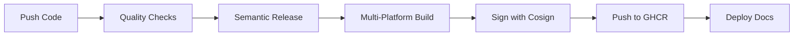

# GitHub AI Projects Package


Welcome to the **GitHub AI Projects Package** - a comprehensive, professionally organized collection of 208 AI systems, frameworks, and tools spanning 35 distinct categories.

## 🎯 Overview

This repository represents a curated ecosystem of artificial intelligence projects, ranging from core operating systems to specialized engines, all packaged with an **Elite Continuous Delivery Pipeline** that ensures:

- ✅ **Automated versioning** with Semantic Release
- 🐳 **Multi-platform Docker images** (amd64/arm64)
- 🔒 **Supply chain security** with Cosign signing and SLSA provenance
- 🚀 **High-performance builds** with BuildKit caching
- 📚 **Versioned documentation** with MkDocs Material

## 📦 What's Inside

### Project Statistics

- **Total Categories:** 35
- **Total Projects:** 208+ successfully packaged
- **Python Files:** 19,864
- **External Dependencies:** 649
- **Lines of Code:** Millions

### Key Categories

1. **Core Operating Systems** - Foundational AI system architectures
2. **Autonomous Intelligence** - Self-directed AI agents
3. **Orchestration & Coordination** - Multi-agent systems
4. **Memory & Knowledge** - Knowledge graphs and memory systems
5. **Graph Networks** - Neural network architectures
6. **Decision Reasoning** - Logic and reasoning engines
7. **Optimization** - Performance and efficiency tools
8. **Learning & Adaptation** - Machine learning frameworks
9. **Swarm & Collective** - Distributed AI systems
10. **And 25+ more categories...**

## 🚀 Quick Start

### Using Docker (Recommended)

```bash
# Pull the latest image
docker pull ghcr.io/lordwilsondev/github_ai_projects_package:latest

# Run the container
docker run -it ghcr.io/lordwilsondev/github_ai_projects_package:latest
```

### Local Development

```bash
# Clone the repository
git clone https://github.com/lordwilsonDev/GITHUB_AI_PROJECTS_PACKAGE.git
cd GITHUB_AI_PROJECTS_PACKAGE

# Install Task (task runner)
# macOS
brew install go-task

# Linux
sh -c "$(curl --location https://taskfile.dev/install.sh)" -- -d -b /usr/local/bin

# Run quality checks
task ci

# Build Docker image locally
task build
```

## 🏛️ Architecture

This repository implements an **Elite Continuous Delivery Pipeline** based on modern DevOps best practices:

### CI/CD Pipeline



### Key Features

- **Taskfile** - Modern YAML-based task runner replacing Make
- **BuildKit** - Advanced Docker builds with intelligent caching
- **GitHub Actions** - Automated CI/CD with concurrency control
- **Semantic Release** - Automated versioning following Conventional Commits
- **Cosign** - Keyless image signing for supply chain security
- **MkDocs Material** - Beautiful, versioned documentation

## 📚 Documentation

Explore the full documentation:

- [Getting Started](getting-started/installation.md) - Installation and setup
- [Architecture](architecture/overview.md) - System design and pipeline details
- [Projects](projects/categories.md) - Browse all 208 projects
- [Development](development/contributing.md) - Contributing guidelines

## 🔒 Security

All Docker images are:

- ✅ Signed with Sigstore Cosign (keyless signing)
- ✅ Include SLSA provenance attestations
- ✅ Include Software Bill of Materials (SBOM)
- ✅ Built with reproducible builds

Verify image signatures:

```bash
cosign verify \
  --certificate-identity-regexp=https://github.com/lordwilsonDev/GITHUB_AI_PROJECTS_PACKAGE \
  --certificate-oidc-issuer=https://token.actions.githubusercontent.com \
  ghcr.io/lordwilsondev/github_ai_projects_package:latest
```

## 🤝 Contributing

We welcome contributions! Please see our [Contributing Guide](development/contributing.md) for details.

All commits must follow the [Conventional Commits](https://www.conventionalcommits.org/) specification:

```
feat: add new AI project category
fix: resolve dependency conflict
docs: update installation guide
```

## 📜 License

This project is licensed under the MIT License - see the LICENSE file for details.

## 👏 Acknowledgments

Built with modern DevOps tools:

- [GitHub Actions](https://github.com/features/actions)
- [Docker BuildKit](https://docs.docker.com/build/buildkit/)
- [Semantic Release](https://semantic-release.gitbook.io/)
- [Sigstore Cosign](https://www.sigstore.dev/)
- [MkDocs Material](https://squidfunk.github.io/mkdocs-material/)
- [Task](https://taskfile.dev/)

---

**Ready to explore?** Start with the [Getting Started Guide](getting-started/installation.md) or browse the [Project Categories](projects/categories.md).
